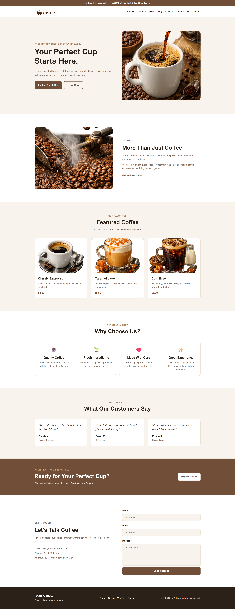
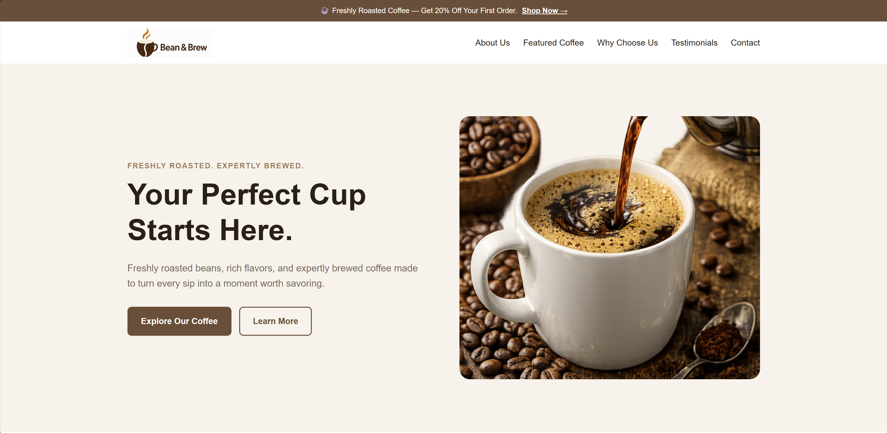

# Bean & Brew Landing Page — Express.js

A responsive coffee shop landing page built with **Express.js, HTML, and CSS**.

This project is part of my practical learning journey with Laravel and Express. I built the same project in both frameworks to understand how similar web applications can be structured using the natural tools and architecture of each ecosystem.

## 🎯 Goal

The goal of this project was to build a complete landing page from scratch while strengthening my understanding of **Express.js fundamentals, Node.js, static file serving, HTTP routing, HTML, and CSS**.

I intentionally built the same type of project separately with Laravel and Express so I could understand the differences between the two ecosystems rather than simply copying the architecture of one framework into the other.

## 🔗 Project Versions

### Laravel

https://github.com/Samiullah-Popalzai/bean-brew-landing-page-laravel

### Express.js

https://github.com/Samiullah-Popalzai/bean-brew-landing-page-express

## 📸 Screenshots

### Full Page



### Hero Section



## ✨ Features

- Promotional banner
- Responsive navigation
- Hero section
- About Us section
- Featured Coffee section
- Why Choose Us section
- Customer testimonials
- Call to action section
- Contact section
- Footer
- Responsive design for desktop, tablet, and mobile
- Custom coffee-themed visual design

## 🛠️ Tech Stack

- Node.js
- Express.js
- HTML5
- CSS3

No frontend CSS framework was used.

## 📁 Project Structure

```text
bean-brew-landing-page-express/
├── src/
│   └── server.js
├── public/
│   ├── index.html
│   ├── css/
│   │   └── style.css
│   └── images/
├── screenshots/
│   ├── full-page.png
│   └── hero-section.png
├── .gitignore
├── package.json
├── package-lock.json
└── README.md
```

## 🚀 Getting Started

### Requirements

Make sure you have installed:

- Node.js
- npm

### Clone the repository

```bash
git clone https://github.com/Samiullah-Popalzai/bean-brew-landing-page-express.git
```

### Enter the project

```bash
cd bean-brew-landing-page-express
```

### Install dependencies

```bash
npm install
```

### Start the server

```bash
node src/server.js
```

Then open:

```text
http://localhost:3000
```

## 🧠 What I Practiced

Through this project, I practiced:

- Node.js fundamentals
- Express.js setup
- Creating an Express application
- Express routes
- Static file serving
- Serving HTML, CSS, and images
- Understanding the Express request/response flow
- HTML semantic structure
- CSS layout
- CSS Grid
- CSS Flexbox
- Responsive design
- Git and GitHub workflow

## 🔄 Laravel Version

The same Bean & Brew landing page was also built using Laravel.

Full repository URL:

https://github.com/Samiullah-Popalzai/bean-brew-landing-page-laravel

The two projects intentionally use the natural approach of their respective frameworks rather than forcing identical architectures.

## 👨‍💻 About Me

I'm **Samiullah Popalzai**, a Full Stack Engineer & WordPress Developer from Kabul, Afghanistan.

I work with technologies including:

- PHP
- Laravel
- WordPress
- JavaScript
- TypeScript
- Node.js
- Express.js
- React
- MySQL
- PostgreSQL
- REST APIs
- GraphQL
- Docker
- HTML
- CSS

I'm particularly interested in building reliable, secure, maintainable, and performant web applications.

### Links

- GitHub: https://github.com/Samiullah-Popalzai
- LinkedIn: https://linkedin.com/in/samiullah-popalzai/
- Portfolio: https://samiullah-popalzai.github.io/

## 📌 Project Status

Completed as a learning project.

The project focuses on understanding the fundamentals of building a landing page with Express.js and comparing that experience with the Laravel implementation.

## Completed:10/7/2026

## 📄 License

All Rights Reserved
